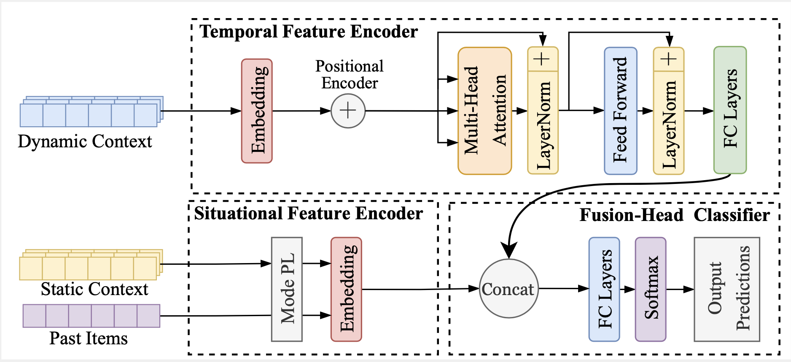

# Context-Aware Recommender System for User Interface Item (CARSI) 

This is the implementaion of CARSI and the data processing pipeline.

Master thesis by Jeremy Wanner (EGD1), ETH Zurich, Switzerland
* Report link (higly detailed):
* Paper link: 

<figure>
  
  <figcaption>...</figcaption>
</figure>

# Data Processing Pipeline

````
vehicle_names = ["SEB880", "SEB882", "SEB883", "SEB885", "SEB888", "SEB889"]
````

### 01 Data Extraction: parsed data to csv

The raw data are previously parsed and stored as `.pncrec` for EsoTrace and `.parqurt` for MF4. The following structure shows how the files need to be ordered:

````
    .
    ├── ...
    ├── Parsed_data                
    │   ├── CAR_ID                                
    │   │     ├── CAR_ID_pncrec
    │   │         ├── day01.pncrec  
    │   │         ├── day02.pncrec 
    │   │         └── ...                          
    │   │     ├── CAR_ID_mf4.parquet
    │   └── ...           
    └── ...
````

Run:
````
python 01_eso_parsed_to_csv.py
python 01_mf4_parsed_to_csv.py
````

### 02 Data Imputation

Run:
````
python 0_mf4_process.py
````

### 03 Data Labeling

The labels were indentified by interacting with the car in the workshop and by exploring the data. Note that the drive mode is labeld from CAN signals.
To complete or change the label mapping in the UI, modify `utils/Labels.yaml`.

Run:
````
python 03_labeling.py
````

### 04 Data Integration
Extend the dataset of CAN signals with UI labels. Merged by closest datetime with a threshold to ensure consistency. 

Run:
````
python 04_merging.py
````

### 05 Event Window Segmentation
Capture time segment of context variables surrounding each label.

Run:
````
python 05_event_windows.py
````

### 06 Weather API
Extend context with weather conditions from https://brightsky.dev/.

Run:
````
python 06_weather_api.py
````

# Model 

### 01 Dataset Preparation

run:
```
python 01_windows_processing.py
```
Description:

1. Perform data processing on windows:
    * Normalization continuous variabes.
    * Label encoder categorical variables .
    * Compute class wigths.
    * Add previous interaction.
2.  Split train and validation set as save in `Dataset/data_{split}.csv`
3. Save param for training and evaluaton in `Dataset/param.pkl`

### 02 Training

Training process saves model params at epoch with best performing accuracy on the validation set. 

Models: 
* CARSI (attention) - **Best model**
* CARSI (rnn)
* CARSI (lstm)
* CARSI (gru)

Select CARSI verison with `--model={version}` (default `attention`)
```
python train.py --model={version}
```
To fine-tune on individual user data:

```
python train.py --car={car_id} --finetune=True
```
*You may want to decrease the learning rate and freeze some layers.*


